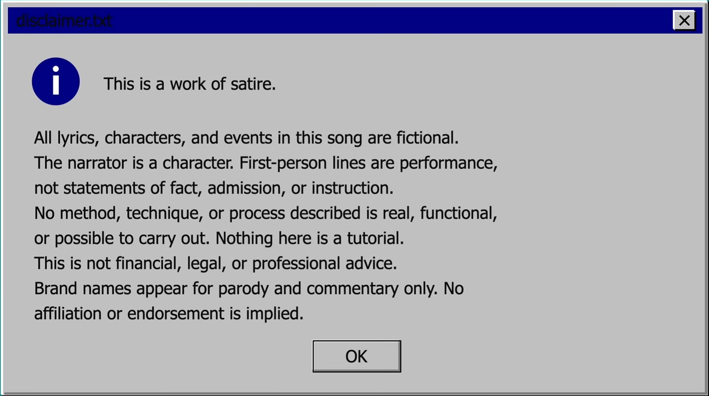

# GlowingFederal: Are you perhaps mad?

I'm a legacy modding focused mod engineer with a specialty in server admin tools and client additions for 1.7.10.

# Major Projects

## Trolling Soyboys 

https://www.youtube.com/watch?v=kskS9EQElaU

## Combatives

Modern movement, combat, and camera overhaul for Minecraft Forge 1.7.10. Adds synchronized crawling and swimming, leaning, advanced first-person camera behavior, improved aiming integration, and compatibility systems for heavily modded clients and servers.

## HandmadeGuns Overdrive

Modernized continuation of HandmadeGuns/GvCEX for Minecraft 1.7.10. Includes major bug fixes, performance improvements, expanded weapon behavior, bundled content support, improved multiplayer compatibility, and native Blockbench model and animation loading for modern-style firearm content.

## Xenofactions

Multiplayer combat and gamemode framework designed for large modded servers. Provides faction and territory systems alongside configurable TDM, Bomb/Defusal, Deathmatch, and FFA modes with teams, kits, economies, map rotation, voting, and server administration tools.

## NEI Resources

Extends Not Enough Items with additional resource information, including ore generation, mob drops, dungeon and structure loot, and other world-resource data.

## AntiSkidAC

Client integrity and anti-tamper framework for modded Minecraft servers. Supports file and directory verification, managed content policies, hash validation, and enforcement of server-required client resources.

## WorldEdit Overdrive

Performance-focused enhancements for legacy WorldEdit, including deferred and accelerated paste execution designed to reduce server-thread stalls during large operations.

## Legacy Profiler

Profiling and diagnostics tools for Minecraft Forge 1.7.10, focused on identifying expensive server operations, world generation, and mod performance bottlenecks.

## Combat Utils

PvP utility and moderation mod providing detection and handling for combat logging, F3+A abuse, and related multiplayer exploits.

## ClearLag

Lightweight Forge mod for periodically removing dropped items and reducing unnecessary entity buildup.

# Links

- "CurseForge" (https://www.curseforge.com/members/hiddenmerit/projects)
- "Modrinth" (https://modrinth.com/user/GlowingFederal)
